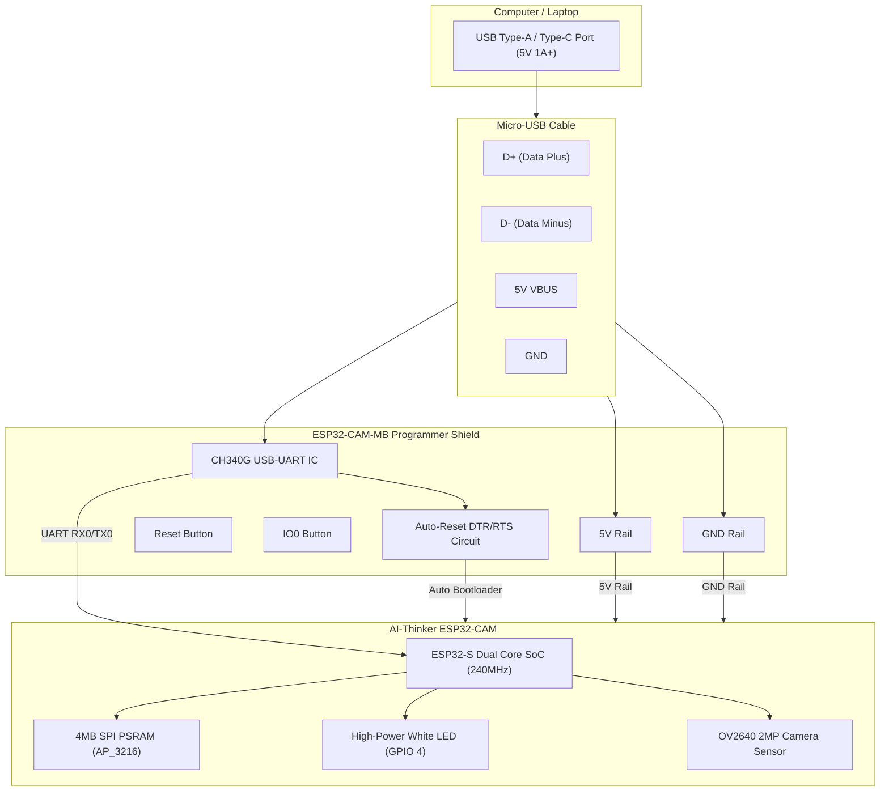

# ESP32-CAM Hardware Wiring & Schematics

This document provides detailed electrical wiring schematics, connection charts, and layout diagrams for the OrthoNex ESP32-CAM camera unit.

---

## 1. ESP32-CAM Module Pin Configuration

```
                         ┌─────────────┐
                         │   OV2640    │
                         │   CAMERA    │
                         │             │
                    ┌────┴─────────────┴────┐
             5V  ───┤ [1]               [16]├── 3V3
            GND  ───┤ [2]               [15]├── 16 (PSRAM / U2RX)
     U0R (GPIO3) ───┤ [3]               [14]├── 0  (Boot Strapping)
     U0T (GPIO1) ───┤ [4]               [13]├── GND
          GPIO4  ───┤ [5] (Flash LED)   [12]├── 2  (HS2_DATA0 / SD)
          GPIO2  ───┤ [6] (Internal)    [11]├── 4  (Flash LED duplicate)
         GPIO14  ───┤ [7] (HS2_CLK)     [10]├── 15 (HS2_CMD)
         GPIO15  ───┤ [8] (HS2_DATA3)    [9]├── 13 (HS2_DATA2)
                    └───────────────────────┘
                     AI-THINKER ESP32-CAM
```

---

## 2. Wiring Schematic: ESP32-CAM with MB Programmer Shield

The **ESP32-CAM-MB** daughterboard mates directly with the ESP32-CAM header pins. It uses an onboard **CH340G USB-to-UART bridge** with auto-reset circuitry.



### Direct Header Mating Table:
| ESP32-CAM Header Pin | MB Shield Socket | Circuit Function |
|:--------------------:|:----------------:|:-----------------|
| **5V**               | 5V               | Regulated 5V rail from USB VBUS |
| **GND**              | GND              | System Common Ground |
| **U0R (GPIO 3)**     | TXD (CH340G)     | ESP UART Receive (Serial In) |
| **U0T (GPIO 1)**     | RXD (CH340G)     | ESP UART Transmit (Serial Out) |
| **GPIO 0**           | DTR Circuit      | Auto-pulled LOW during flashing |
| **RESET**            | RTS Circuit      | Auto-pulsed LOW to reboot module |

---

## 3. Wiring Schematic: FTDI FT232RL USB-to-TTL Adapter

For users programming the ESP32-CAM using a standalone FTDI adapter:

```
        FT232RL FTDI ADAPTER                     ESP32-CAM MODULE
    ┌───────────────────────────┐           ┌───────────────────────────┐
    │                       VCC ├───────────┤ 5V (or 3V3)               │
    │                       GND ├───┬───────┤ GND                       │
    │                       TXD ├───┼───────┤ U0R (GPIO 3)              │
    │                       RXD ├───┼───────┤ U0T (GPIO 1)              │
    │                           │   │       │                           │
    │                           │   │  ┌────┤ GPIO 0                    │
    │                           │   └──┴───>│ (Jump to GND for upload)  │
    │                           │           │                           │
    │                           │           │       [RST BUTTON]        │
    │                           │           │    (Press to enter flash) │
    └───────────────────────────┘           └───────────────────────────┘
```

### Jumper Wire Color Guide:
- 🔴 **Red Wire:** FTDI `VCC` (Set jumper on FTDI to **5V**) ➔ ESP32-CAM `5V`
- ⚫ **Black Wire:** FTDI `GND` ➔ ESP32-CAM `GND`
- 🟢 **Green Wire:** FTDI `TXD` ➔ ESP32-CAM `U0R` (GPIO 3)
- 🟡 **Yellow Wire:** FTDI `RXD` ➔ ESP32-CAM `U0T` (GPIO 1)
- 🔵 **Blue Wire (Flashing Mode):** ESP32-CAM `GPIO 0` ➔ ESP32-CAM `GND`

---

## 4. Standalone Deployment Schematic (Battery / Wall Power)

After flashing, the module can operate untethered using a 5V powerbank or an AC/DC 5V 2A wall adapter:

```
    5V 2A POWER SUPPLY                  ESP32-CAM MODULE
  ┌─────────────────────┐             ┌───────────────────────────────────┐
  │         +5V DC Rail ├──────┬──────┤ 5V                                │
  │                     │      │      │                                   │
  │                     │    ┌─┴─┐    │                                   │
  │                     │    │ + │    │                                   │
  │                     │    │470│    │                                   │
  │                     │    │ µF│    │                                   │
  │                     │    │   │    │                                   │
  │                     │    └─┬─┘    │                                   │
  │                     │      │      │                                   │
  │            GND Rail ├──────┴──────┤ GND                               │
  └─────────────────────┘             │                                   │
                                      │ GPIO 0: LEFT FLOATING (DISCONNECTED)
                                      │ U0R / U0T: LEFT DISCONNECTED      │
                                      └───────────────────────────────────┘
```

> [!TIP]
> The **470µF electrolytic capacitor** placed across `5V` and `GND` prevents brownout restarts during Wi-Fi connection and frame transmission spikes.

---

## 5. Servo Motor (Pan / Tilt) Wiring Schematic

When adding a tracking rig (SG90 or MG90S micro-servos) to the ESP32-CAM:

```
                          5V 2A POWER SUPPLY / MB SHIELD
                       ┌──────────────────────────────────┐
                       │                              5V  ├───┬─────────────┬─────────── [Red: Servo 1 VCC]
                       │                                  │   │             │
                       │                                  │ ┌─┴─┐         ┌─┴─┐
                       │                                  │ │ + │ 220µF   │ + │ 100nF   [Red: Servo 2 VCC]
                       │                                  │ │   │ to      │   │ Ceramic 
                       │                                  │ │   │ 470µF   │   │
                       │                                  │ │ - │         │ - │
                       │                                  │ └─┬─┘         └─┬─┘
                       │                              GND ├───┴─────────────┴───┬─────── [Black: Servo 1 GND]
                       └──────────────────────────────────┘                     │
                                                                                │        [Black: Servo 2 GND]
                       AI-THINKER ESP32-CAM                                     │
                       ┌──────────────────────────────────┐                     │
                       │                              GND ├─────────────────────┘
                       │                          GPIO 13 ├───────────────────────────── [Orange: Pan Servo PWM]
                       │                          GPIO 14 ├───────────────────────────── [Orange: Tilt Servo PWM]
                       │                                  │
                       │ [OV2640 CAMERA LENS]             │
                       └──────────────────────────────────┘
```

### Servo Pinout Quick Reference:
| Servo Wire Color | Signal Name | ESP32-CAM Target Pin | Electrical Notes |
|:---:|:---:|:---:|:---|
| 🔴 **Red** | Power (VCC) | **5V Pin** | Must receive 4.8V–6.0V. **NEVER connect to 3.3V pin!** |
| 🟤 / ⚫ **Brown / Black** | Ground (GND) | **GND Pin** | Common ground between power source, servo, and ESP32. |
| 🟠 / 🟡 **Orange / Yellow** | PWM Signal (Pan) | **GPIO 13** | Primary pan axis (horizontal 0° to 180°). |
| 🟠 / 🟡 **Orange / Yellow** | PWM Signal (Tilt) | **GPIO 14** (or **GPIO 15**) | Optional tilt axis (vertical pitch 0° to 60°). |

> [!WARNING]
> **Avoid Restricted Pins:**
> - **DO NOT USE GPIO 16:** Connected to 4MB external PSRAM chip select; touching it crashes camera memory.
> - **DO NOT USE GPIO 0:** Camera 20MHz XCLK master clock and boot pin.
> - **DO NOT USE GPIO 4:** Connected to high-power white Flash LED.
